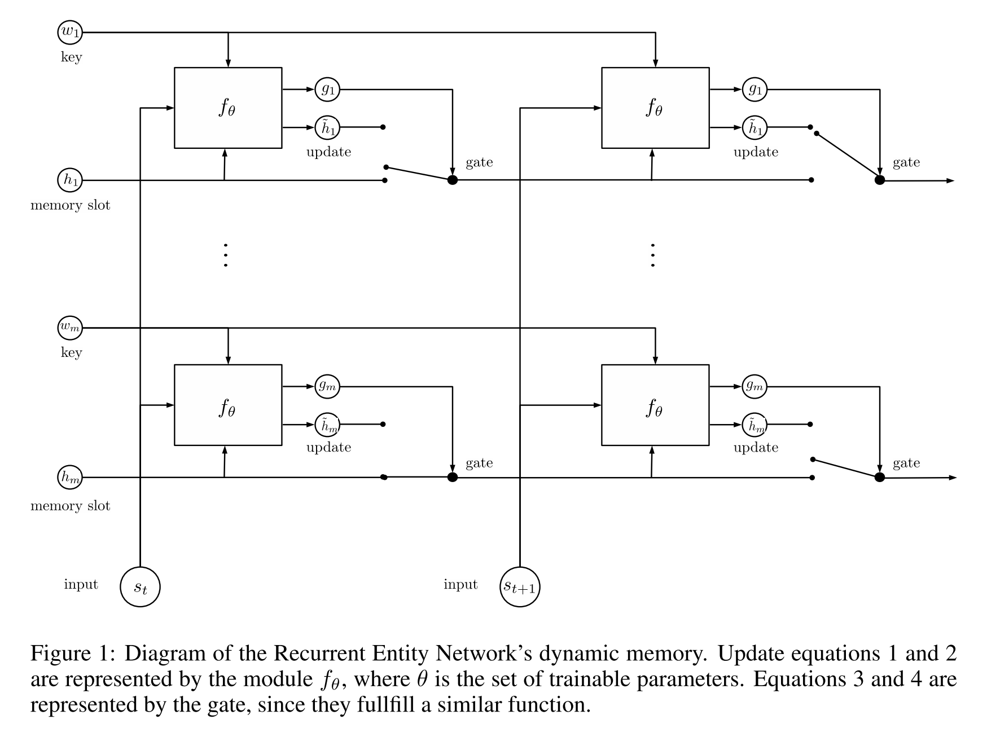

# Recurrent Entity Networks

This repository contains an independent TensorFlow implementation of recurrent entity networks from [Tracking the World State with
Recurrent Entity Networks](https://openreview.net/forum?id=rJTKKKqeg). This paper introduces the first method to solve all of the bAbI tasks using 10k training examples. The author's original Torch implementation is available [here](https://github.com/facebook/MemNN/tree/master/EntNet-babi).

## Results

Percent error for each task, comparing those in the paper to the implementation contained in this repository.

Task | EntNet (paper) | EntNet (repo)
--- | --- | ---
1: 1 supporting fact | 0 | 0
2: 2 supporting facts | 0.1 | 3.0
3: 3 supporting facts | 4.1 | ?
4: 2 argument relations | 0 | 0
5: 3 argument relations | 0.3 | ?
6: yes/no questions | 0.2 | 0.1
7: counting | 0 | ?
8: lists/sets | 0.5 | ?
9: simple negation | 0.1 | 0.7
10: indefinite knowledge | 0.6 | 0.1
11: basic coreference | 0.3 | 0
12: conjunction | 0 | 0
13: compound coreference | 1.3 | 0
14: time reasoning | 0 | 4.5
15: basic deduction | 0 | 0
16: basic induction | 0.2 | 54.0 ([#5](../../issues/5))
17: positional reasoning | 0.5 | 1.7
18: size reasoning | 0.3 | 1.5
19: path finding | 2.3 | 41.9 ([#5](../../issues/5))
20: agents motivation | 0 | 0.2
**Failed Tasks** | 0 | ?
**Mean Error** | 0.5 | ?

## Setup

1. Download the datasets by running [download_datasets.sh](download_datasets.sh) or from [The bAbI Project](https://research.facebook.com/research/babi/).
2. Run [prep_datasets.py](prep_datasets.py) which will convert the datasets into [TFRecords](https://www.tensorflow.org/versions/r0.11/how_tos/reading_data/index.html#standard_tensorflow_format).
3. Run `python -m entity_networks.main` to begin training on QA1.
4. Run `./run_all.sh` to train on all tasks.

## Dependencies

- TensorFlow v0.11

## Thanks!

- Thanks to Mikael Henaff for providing details about their paper over Thanksgiving break. :)
- Thanks to Andy Zhang ([@zhangandyx](https://twitter.com/zhangandyx)) for helping me troubleshoot numerical instabilities.
- Thanks to Mike Young for providing results on some of the longer tasks.
